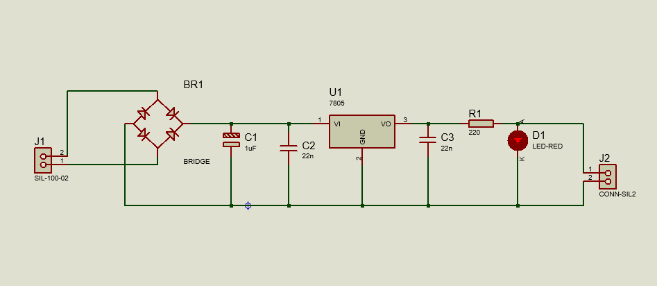
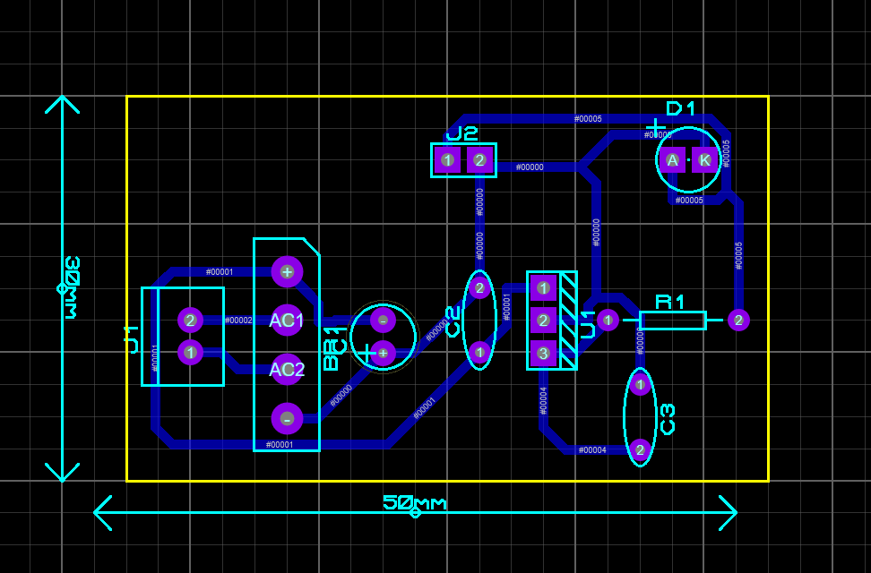
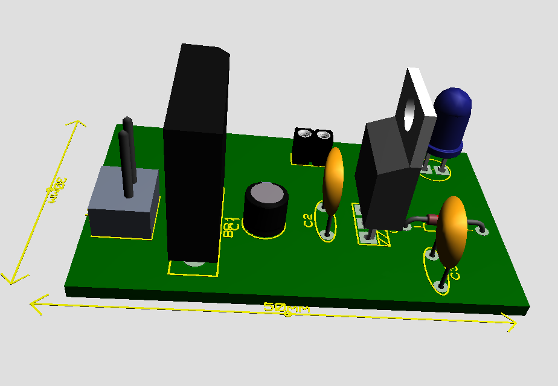
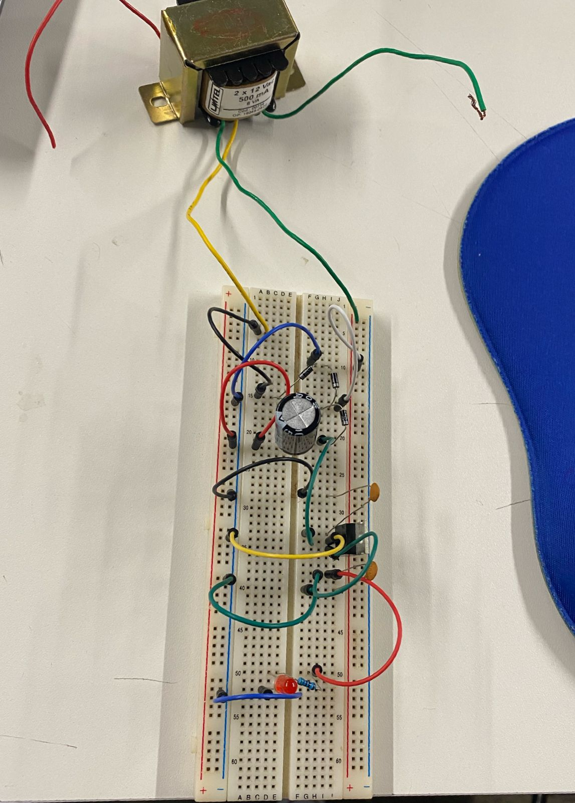
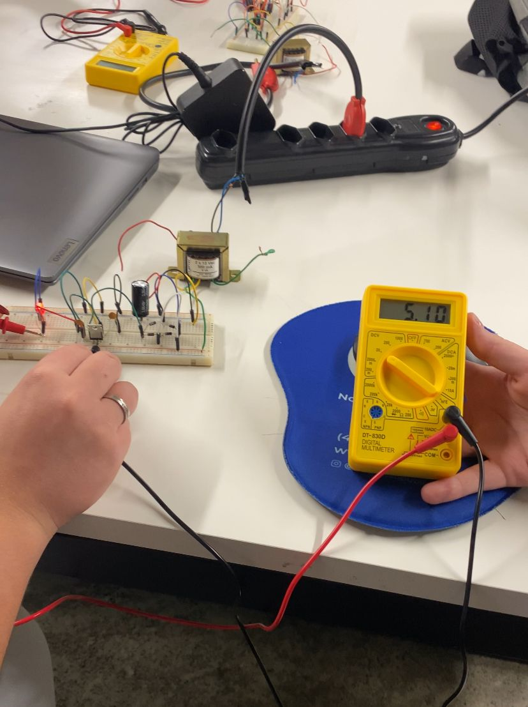
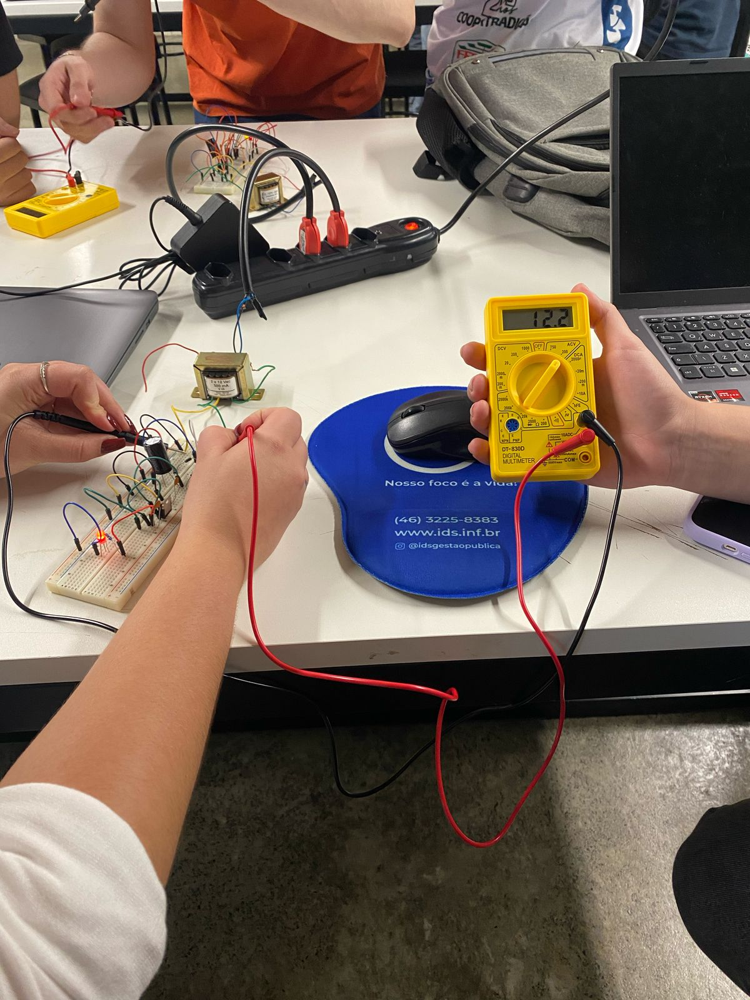

<h2>Descrição do projeto</h2>

Este projeto consiste no desenvolvimento de um retificador utilizando o software Proteus para o desenho do esquemático, da PCB e da visualização em 3D. Além disso, implementamos o circuito na prática utilizando uma protoboard para testar seu funcionamento.

<h2>Ferramentas utilizadas</h2>
<ul>
    <li><strong>Proteus</strong>: Para criação do esquemático, layout da PCB e renderização 3D.</li>
    <li><strong>Protoboard</strong>: Para montagem física do circuito e testes.</li>
    <li><strong>Componentes eletrônicos</strong>: Diodos, transformador, capacitor, resistor, regulador de tensão.</li>
</ul>

<h2>Passos executados</h2>

<h3>1. Desenho do esquemático</h3>

Utilizamos o Proteus para desenhar o circuito do retificador. O circuito inclui um transformador para redução de tensão, um conjunto de diodos para retificação e capacitores para filtragem.

    

<h3>2. Criação da PCB</h3>

A partir do esquemático, projetamos a PCB no Proteus, posicionando os componentes e roteando as trilhas para garantir um bom desempenho do circuito.

    

<h3>3. Visualização 3D</h3>

Utilizamos o recurso de renderização 3D do Proteus para visualizar como a PCB ficaria no mundo real antes da fabricação.

    

<h3>4. Montagem prática na protoboard</h3>

Após a validação do projeto no Proteus, montamos o circuito na protoboard, utilizando os mesmos componentes do projeto simulado.

    

<h3>5. Testes e validação</h3>

Realizamos medições com um multímetro para verificar a saída do retificador e garantir que os valores estavam dentro das expectativas.

    
    

<h2>Conclusão</h2>

Este projeto permitiu compreender o funcionamento de um retificador e a importância da simulação antes da implementação física. A utilização do Proteus facilitou a criação e validação do circuito antes da montagem na protoboard.

Proprietária do projeto: Tainá Mariott

